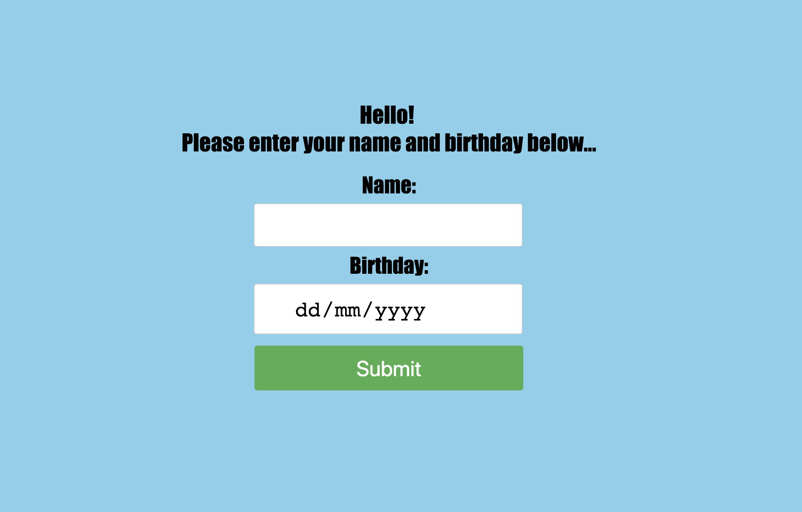
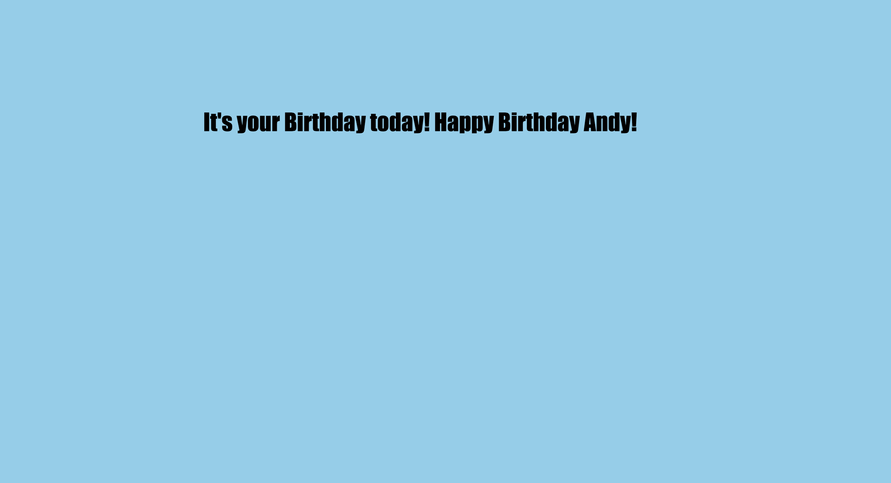
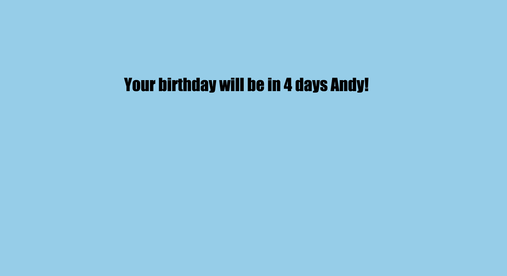

# Birthday Web App

This is a simple web app built using sinatra that takes a name and birthday from the user via a form and will display a birthday message if the user's birthday is today. Otherwise it will display a message telling the user how many days left until their birthday

## How to run

To run this app, first clone it from this repo and from the root directory perform `bundle install`.
You can then run the app from the root directory by entering `rackup -p 9393`.
Finally go to `localhost:9393` to access the home page.

## Screenshots

Homepage:

Birthday Message:

Countdown Message:

